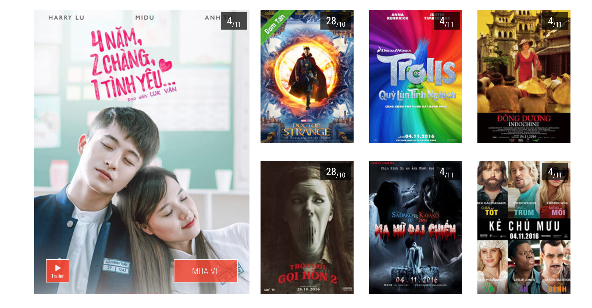
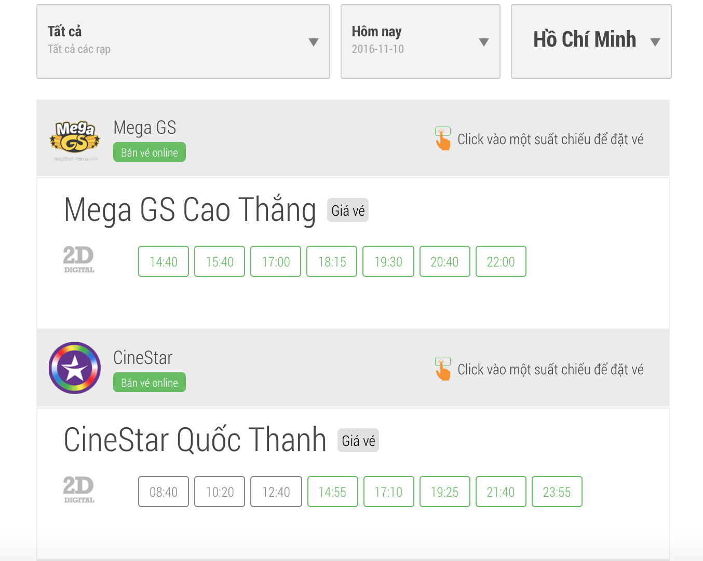
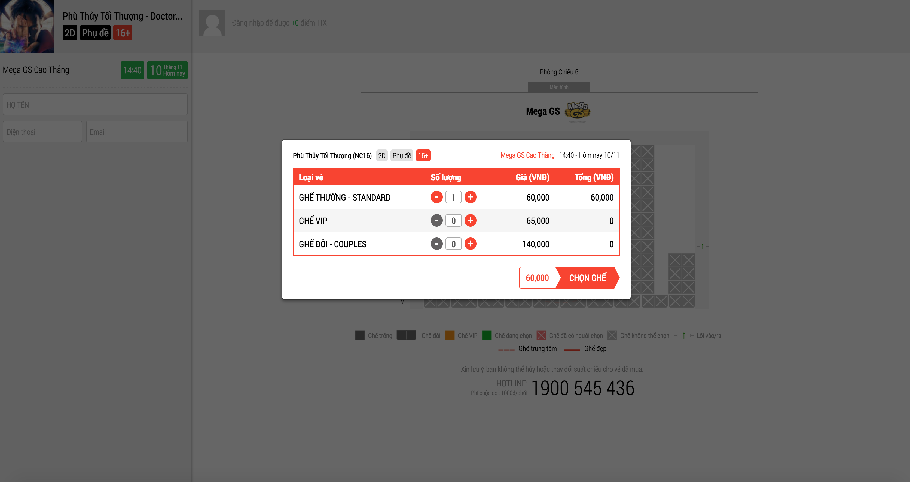
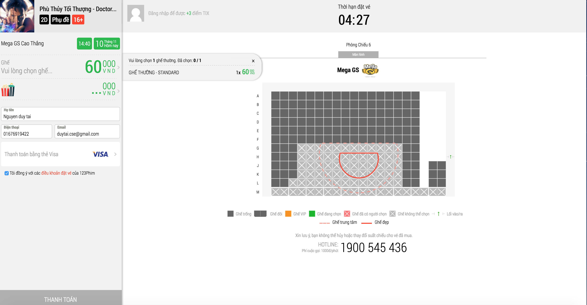

# Booking Lite

### Introduction

Booking Lite is a powerful tool in order buy tickets from your favorite cinemas, just choose movies, cinema, time then take your electronic ticket and enjoy watching.

### Requirements

1. User System

   - User uses a personal Facebook, Google account or manually fill email and password to create new account. Email address must be verified
   - User can change and reset password

2. Dashboard

   - List all movies now playing and up coming movies

     

   - After selecting your movie, user see list of cinemas, available time slots of today

     

   - After selecting a time slot, user will be redirected to booking page, this page require login:

     

     

   - After successful selecting suitable places, a notification email about this transaction will be sent to user's email 

3. Data Importation

   - Using crawler to craw data from other servers or create new page to import data

**Requirements contain very basic components of your application, you are encouraged to propose new features as you need**

