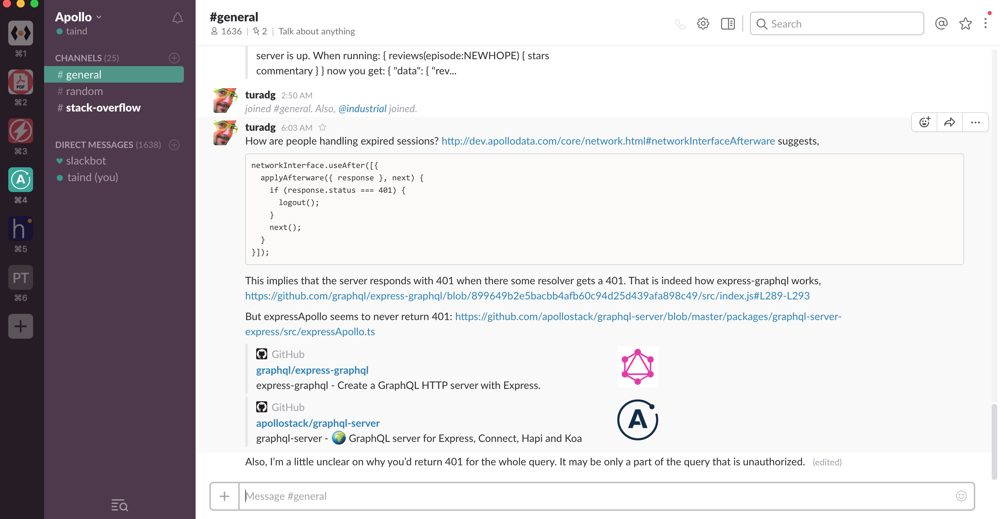
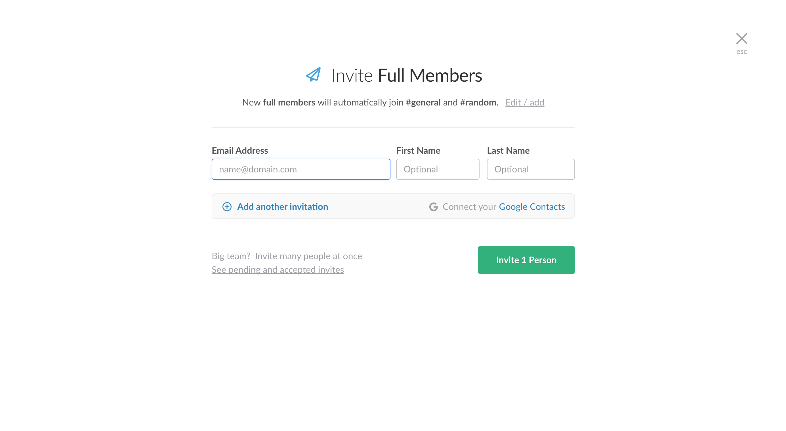
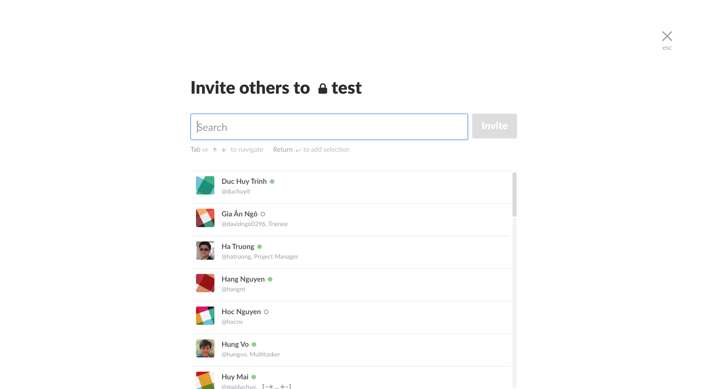

# Slack Lite

### Introduction

Slack Lite is a minal web application version of Slack. It is a powerful communucation framework for your team in one place. Slack Lite provides: 

- Real time messaging and file sharing for one-to-one and group conversations
- Powerful search tool, so you can find information easily

### Requirements

1. User System

   - User uses a personal Facebook, Google account or manually fill email and password to create new account. Email address must be verified

-    After creating new account user must choose team's name, update avatar then go to main messages board, team's creator is team's admin.

     

-    User can change and reset password

2. Invitation

   - Team's admin invites other users to join team by sending an invitation link via email

     

   - By default, team members only see ***#general*** and ***#random*** channel   

3. Channels

   - Every user has privilege to create private channels and invite team members to this channel or create pulic channels that other member can search then join.

     

   - Channel's creator is admin who has privilege to add and remove members

4. Messages

   - A member can sends direct text messages/ files to other members or channel
   - Member can search for messages from history

**Requirements contain very basic components of your application, you are encouraged to propose new features as you need**