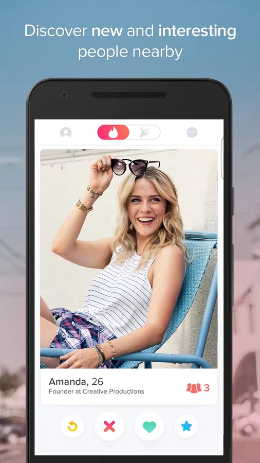
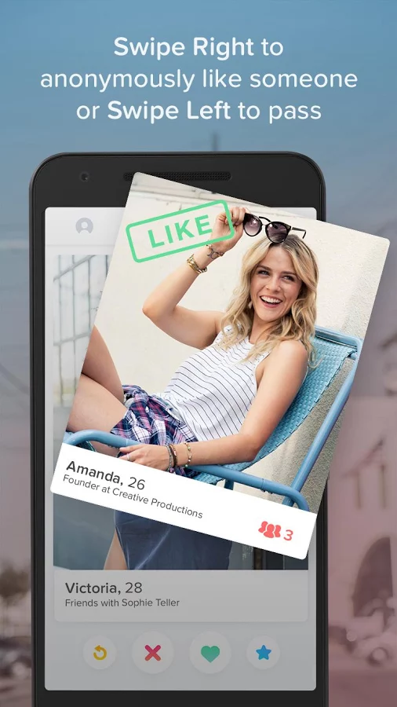
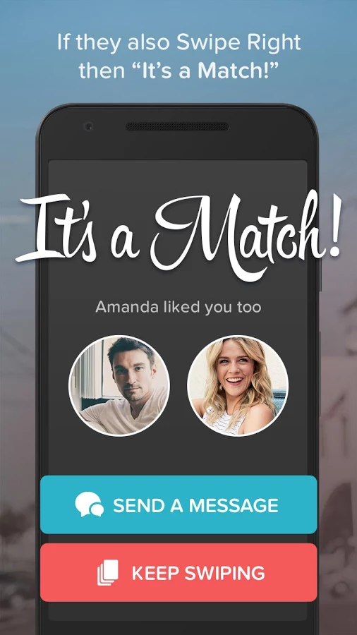
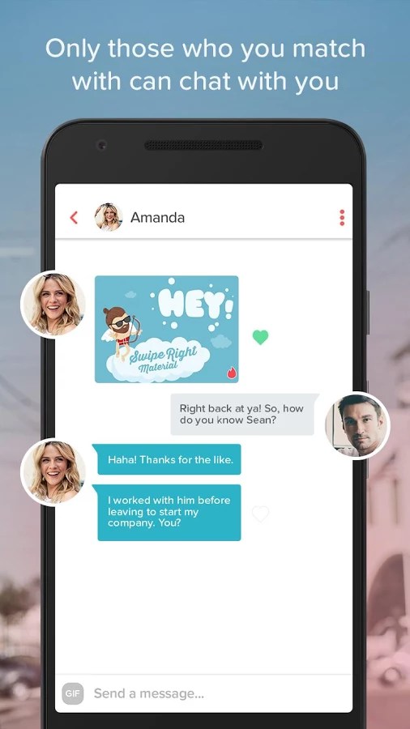

# Tinder Lite

### Introduction

Tinder Lite is a  minimal web application version of [Tinder](https://play.google.com/store/apps/details?id=com.tinder). It is a powerful tool to meet people and expand your social group. Making new connection on Tinder Lite is easy and fun - just swipe right to like someone, or swipe left to pass. If someone likes you back, it is match then chat online with your matches.

### Tech Stack

1. Meteor 
2. React
3. MongoDB

### Some Screens

  

 

 

 

### Requirements

1. User System
   - User uses a personal Facebook, Google account or manually fill email and password to create new account. Email address must be verified
   - User can change and reset password
2. Matching Session
   - After creating new account, user must upload images to gallery and choose one from these images to publish to matching feature and mark as avatar before starting matching.
   - User must complete above step before starting matching. On matching session, user swipes left to pass or swipes right to like someone, If someone likes back then chat online with matches.   
3. Online Chat
   - User can chats online with matches
   - User can block/remove matches from friend list

***Requirements contain very basic components of your application, you are encouraged to propose new  features as you need***